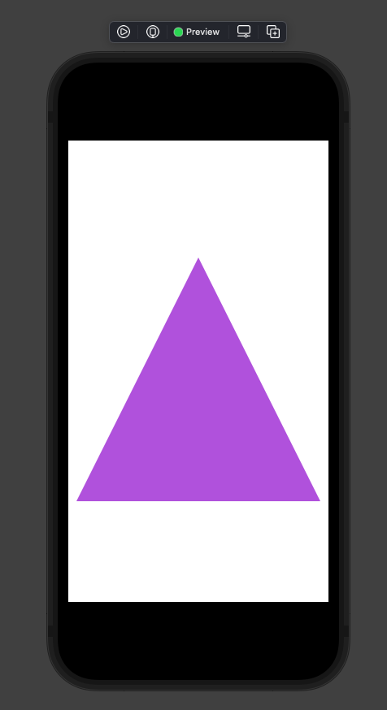

# Lecture 5: ViewBuilder + Shape + ViewModifier

## Access Control
- Ist immer wichtig
- internal, public, private, fileprivate
- private(set)

## @ViewBuilder
- Gibt diese "list-oriented" Syntax
- Technisch: Lambda, das mehrere Ausdrücke (Expressions) zurückgeben darf
- Man kann damit eine eine `func` oder `var` annotieren, die `some View` zurückgibt
- Der Compiler interpretiert diese Funktion als eine, die **eine Liste von Views zurückgibt**:
    + Die Liste wird kombiniert zu einer `TupleView` (max 10.)
    + Oder einer `ConditionalContentView` (if-else)
    + Oder einer `EmptyView` (z.B. if ohne else)
    + Oder eine beliebige Kombination dessen, weil das alles `some View` sind (rekursive Datenstruktur)

Beispiel:
```swift
@ViewBuilder
func front(of card: Card) -> some View {
    RoundedRectangle(cornerRadius: 10)
    RoundedRectangle(cornerRadius: 10).stroke()
    Text(card.content)
}
```
- Das würde eine `TupleView<RoundedRectangle, RoundedRectangle, Text>` zurückgeben.
- Für uns ist aber nur interessant, dass es `some View` ist (Polymorphie)

Ohne @ViewBuilder, müssten man einen Builder so schreiben:
```swift
func front(of card: Card) -> View {
    var builder = VStackBuilder()
    builder.add(RoundedRectangle(cornerRadius: 10))
    builder.add(RoundedRectangle(cornerRadius: 10).stroke())
    builder.add(Text(card.content))
    return builder.build()
}
```
Nichts anderes als *Syntax Sugar* für eine "list-orientierte" Syntax

## Shape
- Shape (protocol) ist eine View
- Überall, wo `some View` erwartet wird, kann ein Shape übergeben werden
- Beispiele für Shapes: `RoundedRectangle`, `Circle`, `Capsule`, etc..
- Shape implementiert `var body: some View` selbst, man muss nur `func path(in rect: CGRect) -> Path` liefern
- Ein Path ist ein 2D Shape
- Shapes zeichnen sich, indem sie sich mit der aktuellen `foregroundColor` füllen (`.fill()`)

Beispiel für ein Dreieck
```swift
struct Triangle: Shape {
    func path(in rect: CGRect) -> Path {
        var path = Path()
        path.move(to: CGPoint(x: rect.midX, y: rect.minY))
        path.addLine(to: CGPoint(x: rect.minX, y: rect.maxY))
        path.addLine(to: CGPoint(x: rect.maxX, y: rect.maxY))
        path.addLine(to: CGPoint(x: rect.midX, y: rect.minY))
        return path
    }
}
```

Verwendung
```swift
struct ContentView: View {
    var body: some View {
        Triangle()
            .fill(Color.purple)
            .frame(width: 300, height: 300)
    }
}
```



## ViewModifier
- ViewModifier sind `.aspectRatio()`, `.padding()`, `.foregroundColor`, `.font`
- Das sind Funktionen, die eine *veränderte View* zurückgeben
- Einige davon modifizieren, indem Sie die `modifier(:ViewModifier)` Funktion von View aufrufen

Beispiel:
```swift
// Der Aufruf von
.aspectRadio(2/3)
// ist ein Wrapper um den Anruf von
.modifier(AspectModifier(2/3))
// wobei AspectModifier ein struct ist, das ViewModifier protocol implementiert
```

`ViewModifier` ist ein protocol mit einer Funktion von `View -> View`. Die erste View ist die, auf der `.modifier` aufgerufen wird, also die View, die modifiziert werden soll. Die zweite View ist die neue modifizierte View.

Beispiel: 
```swift
Text("👻") // erste View ohne Padding
    .padding(10) // zweite View mit Padding
```

ViewModifier protocol:
```swift
protocol ViewModifier {
    associatedtype Content // typ parameter für protocols

    func body(content: Content) -> some View {
        // modified content
        content
    }
}
```

Beispiel Implementierung für `.cardify`:
```swift
// Normaler Aufruf: 
Text("👻")
    .modifier(Cardify(isFaceUp: true))

struct Cardify: ViewModifier {
    var isFaceUp: Bool

    func body(content: Content) -> some View { // content ist Text("👻")
        ZStack {
            if isFaceUp {
                RoundedRectangle(cornerRadius: 10)
                RoundedRectangle(cornerRadius: 10).stroke()
                content // hier wird Text("👻") angezeigt
            } else {
                RoundedRectangle(cornerRadius: 10)
            }
        }
    }
}
```

Sugar Wrapper:
```swift
// Sugar Aufruf: 
Text("👻")
    .cardify(isFaceUp: true)

extension View {
    func cardify(isFaceUp: Bool) -> some View {
        self.modifier(Cardify(isFaceUp: isFaceUp))
    }
}
```